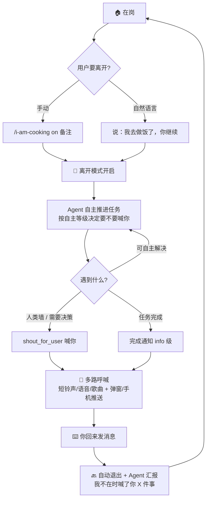

# 🍳 I am cooking

> 你离开电脑时（比如去做饭🍳了），pi 继续自主干活。当它真正卡住、需要你时——或任务完成时——会**大声呼喊你**：声音、中文 TTS、桌面弹窗、**手机推送**，厨房里的你也能听到。

呼喊时 agent 说：**"pi 需要你！"**

[English version](docs/README.en.md)

## ✨ 功能

| 功能 | 说明 |
|---|---|
| 🧠 自主模式 | 离开时注入"自主推进，别干等"规则，agent 继续干活而不是停下来等你 |
| 🤖 Agent 自主开启 | 说"我去做饭了""我离开一下""I'm cooking"，agent 理解后自动开启（无需记命令） |
| 📣 多路呼喊 | 声音 + 中文 TTS + 桌面弹窗 + **手机推送** + TUI 横幅，总有一路能传到你 |
| 🎵 自定义铃声 | 三段式播放：短铃声 → Agent 语音 → 你自己的歌（`/i-am-cooking sound`），到点自动停 |
| 🗣️ Agent 自由语音 | 呼喊时 agent 可原样说出想说的话（`ttsText`），不限于默认模板 |
| 📱 手机推送 | ntfy.sh（免费，零配置）— 厨房场景的关键通道 |
| 🔔 完成通知 | agent 完成任务时喊："主人，好消息！任务完成了！" |
| 🗣️ 自定义呼喊短语 | 默认"agent 需要你"，可改成你喜欢的话（支持占位符） |
| 🎭 可爱 Topic | 编程/算法风自动生成（如"幻觉的提示词-483726"），保证唯一 |
| 🎛️ 动态偏好 | 从你的话里自动切换：别喊了→静音 / 完成后喊我→完成才喊 / 随时汇报→积极模式 |
| 🚀 自主等级 | 该不该喊你的阈值：谨慎(遇墙就喊) / 平衡(默认) / 放手(能不喊就不喊) |
| 🤝 多 Agent 互斥 | 多个 pi 同时离开时，同一时刻只放一个声音；任一 Agent 回来，其他全关 |
| 🛡️ 安全网 | agent 以"？"结尾等你回复时自动喊（放手等级下仅报错才喊） |
| 🔙 自动退出 | 离开时你发消息 → "我回来了"，agent 汇报 |
| 🔊 音量控制 | 可选：离开时自动拉高音量（含解除静音），回来恢复原值 |
| 🗣️ 交互式配置 | `/i-am-cooking setup` — 向导式，含 ntfy 引导 + 预览确认 + 配错可重填 |
| 🔐 Token 安全 | 配置值支持 `${ENV_VAR}`，token 不落盘明文 |
| 🧠 用户可编辑规则 | 行为规则是 `rules.md` 单一文件，随改随生效 |
| 💻 跨平台 | Windows / macOS / Linux |

## 🎯 工作流程



**一句话版本**：你说要走（或直接说"我去做饭了"）→ 离开模式开启 → agent 自主干活，该喊时多路呼喊你 → 你回来发消息 → 自动退出并汇报。

## 📦 安装

```bash
# GitHub 安装（推荐）
pi install git:github.com/Nita121388/i-am-cooking

# 本地开发路径（从源码调试时用）
pi install /path/to/your/local/checkout

# npm 发布后
pi install npm:i-am-cooking
```

安装后 `/reload` 或重启 pi 生效。

## 🚀 快速开始

```bash
/i-am-cooking setup                     # ① 配置手机推送（交互式向导）
/i-am-cooking test                      # ② 测试所有通道（声音/TTS/弹窗/手机）
/i-am-cooking on 继续做登录模块          # ③ 开启离开模式，走人
/i-am-cooking off                       # ④ 我回来了，agent 汇报
/i-am-cooking status                    # 查看状态
```

> 💡 **开启方式有两种**：
> - **自动**：直接说"我去做饭了，你继续"、"我离开一下，有事喊我"、"I'm cooking"，agent 会**理解你的意思并自主开启**（`enter_cooking_mode`）。仅在表达非常明确时才开启，不会误开。
> - **手动**：`/i-am-cooking on [备注]`（备注可带偏好，如 `on 完成后喊我`）。

> ⚠️ **离开状态不跨会话**：任何会话启动都从"在岗"开始。上次会话开启的离开模式不会自动恢复——需要时再次开启即可。

## 📖 命令

| 命令 | 说明 | 示例 |
|---|---|---|
| `/i-am-cooking on [备注]` | 开启离开模式。备注可带偏好和自主等级 | `on 完成后喊我` / `on 谨慎点继续调研` |
| `/i-am-cooking off` | 关闭离开模式，agent 收到"喊了你什么"的汇报 | `off` |
| `/i-am-cooking status` | 查看模式/待处理呼喊/通道/音量/偏好/等级/防打扰参数 | `status` |
| `/i-am-cooking setup` | 交互式配置向导（手机推送 + 音量 + 自主等级） | `setup` |
| `/i-am-cooking test` | 测试所有通道，逐通道汇报真实结果 | `test` |
| `/i-am-cooking rules` | 查看当前生效的规则 | `rules` |
| `/i-am-cooking edit-rules` | 编辑规则文件（保存即生效） | `edit-rules` |
| `/i-am-cooking reset-rules` | 规则恢复出厂默认 | `reset-rules` |
| `/i-am-cooking level [档位]` | 自主等级：`conservative`/`balanced`/`autonomous`，不填则查看 | `level autonomous` |
| `/i-am-cooking limits` | 查看/调整防打扰参数（交互式中文菜单） | `limits` |
| `/i-am-cooking sound` | 自定义呼喊铃声（交互式中文菜单） | `sound` |

子命令支持 Tab 补全：输入 `/i-am-cooking ` 后按 Tab 弹出选项。

## 🤖 Agent 工具（给 LLM 用的能力）

除了你手动敲命令，**agent 自己也会调用 4 个工具**来理解你、喊你、调整行为。这些是"人机协作"的接口：

| 工具 | 作用 | Agent 何时调用 |
|---|---|---|
| `enter_cooking_mode` | 开启离开模式 | 你说"我去做饭了/我离开一下/I'm cooking"等**非常明确**的离开表达时；不确定不调用 |
| `set_shout_sound` | 设置呼喊铃声的自定义歌曲 | 你说"帮我换个铃声""用 xxx.mp3 当提醒音"并给了具体路径时 |
| `shout_for_user` | 大声呼喊你 | 遇到必须你处理的事（决策/凭据/审批/澄清），**先准备好交接内容（刚好够用）再喊**，或任务完成时 |
| `set_calling_preference` | 调整呼喊偏好（响不响） | 你说"别喊了"→silence、"完成后喊我"→completion_only 等 |
| `set_autonomy_level` | 调整自主等级（该不该喊） | 你说"遇墙就喊"→conservative、"能不喊就不喊"→autonomous 等 |

**`shout_for_user` 参数说明**：

| 参数 | 必填 | 说明 |
|---|---|---|
| `message` | ✅ | **交接说明（一次性最终版）**：需你做什么 + 必需的材料/凭据/步骤（仅列必要的） |
| `urgency` | ✅ | `info`（完成通知）/ `normal` / `urgent`（紧急） |
| `category` | ❌ | 分类：decision / credential / approval / clarification / help |
| `ttsText` | ❌ | **自由语音**：TTS 原样念这段，不走默认模板 |

> 这些工具在离开模式关闭时会安全降级（如 `shout_for_user` 会提示"用户就在电脑前"），不会误发呼喊。

### Agent 不能设置什么（安全边界）

| 配置 | 设置方式 | 为什么不交给 agent |
|---|---|---|
| 📱 手机推送（ntfy/webhook + token） | `/i-am-cooking setup` 向导 / 手动改 config.json | 敏感凭据，只应人工配置 |
| 🔊 音量提升开关 | `/i-am-cooking setup` 向导 | 系统级改动，需用户明确允许 |
| 🛡️ 防打扰参数 | `/i-am-cooking limits` | 护栏参数，默认值已合理，避免被误改 |
| 🧠 规则文件 rules.md | `/i-am-cooking edit-rules` / 手动编辑 | 规则是用户的意志，agent 不应自我修改 |
| 🔘 开关（sound/tts/toast） | `/i-am-cooking sound` 菜单「开关」 | 可选开关，命令已支持 |
| 🔙 离开模式退出 | 无工具（仅用户发消息/`off` 退出） | 防止 agent 自我解除离开模式 |

## 🧠 用户可编辑规则

agent 离开模式的行为规则不是写死的，你可以自己改：

```
/i-am-cooking edit-rules    # 打开编辑器改规则（保存即生效）
/i-am-cooking rules         # 查看当前生效规则
/i-am-cooking reset-rules   # 恢复出厂默认（从 rules.default.md 拷贝）
```

规则文件在 `~/.pi/i-am-cooking/rules.md`（Markdown），**首次启动插件时自动创建**（从出厂默认模板拷贝）——直接去这个文件夹改就行，任何编辑器都能编辑，它就是唯一生效的规则。

**出厂默认模板**在仓库里：`extensions/i-am-cooking/rules.default.md`（进 git，随插件版本更新）。开发时直接看/改这份文件；用户首次运行时会自动拷贝一份到 `~/.pi/i-am-cooking/rules.md`，之后完全由用户接管。

### ⏰ 什么时候生效？

规则**每回合实时读取、零缓存**——`before_agent_start` 时插件重新读文件并注入 system prompt。所以：

```
你在任何编辑器里改 rules.md → 保存
  ↓ 无需重启 / 无需 /reload / 无需重新 on
下一次 agent 回合开始 → 新规则生效
```

| 你改的内容 | 效果 |
|---|---|
| 加一条"不修改生产代码" | 下次离开回合起 agent 遵守（取决于 LLM 理解） |
| 删掉"什么时候需要喊我"段落 | 喊我时机交给自主等级指南（等级是机制层，不受影响） |
| 清空整个文件 | 只剩底线规则 + 等级指南，agent 仍不会干等 |
| 改文件但不在离开模式 | **不生效**（规则只在离开模式下注入） |
| 改仓库 `rules.default.md` | 不影响已生成的用户 rules.md；只影响未来首次安装 / `reset-rules` |

> ⚠️ 规则**只在离开模式下注入**（`before_agent_start` 会检查 `config.cooking`），普通对话中改规则不会影响 agent。

> ⚠️ 有一条**底线规则**永远追加、无法删除：*"绝不要默默结束回合等用户回复"*——防止规则被删空导致 agent 干等。

## 🧠 动态呼喊偏好

呼喊偏好管"**喊得响不响**"。agent 从你的话里自动判断，**两种方式并行**：

1. **文字匹配**（扩展代码，毫秒级）：你说"别喊了" → 立即静音，不依赖 agent
2. **语义理解**（agent）：你说"我睡会儿" → 理解为静音，调用 `set_calling_preference`

| 你说 | 模式 | 效果 |
|---|---|---|
| （不说） | `normal`（默认） | 需要你 + 完成都喊 |
| "别喊了" / "安静" / "静音" | `silence` | 全静音，只剩横幅 |
| "完成后喊我" / "干完通知我" | `completion_only` | 只有完成才响铃 |
| "只有紧急才找我" | `urgent_only` | 只有 urgent 才响铃 |
| "随时汇报" / "每步告诉我" | `eager` | 需要你 / 完成 / 进度都喊 |

## 🚀 自主等级（autonomy level）

自主等级管"**该不该喊你**"——遇到阻塞（比如**人类墙**：验证码 / 登录 / 手动点击等必须你手动处理的事）时，agent 自己解决还是喊你。**与呼喊偏好正交**：等级决定"要不要喊"，偏好决定"喊多响"，自由组合。

```
/i-am-cooking level                   # 查看当前等级
/i-am-cooking level conservative      # 谨慎：遇墙就喊
/i-am-cooking level balanced          # 平衡（默认）：有点难度才喊
/i-am-cooking level autonomous        # 放手：能不喊就不喊
```

| 等级 | 行为 |
|---|---|
| `conservative` 谨慎 | 遇到任何人类墙（验证码 / 登录 / 手动点击等）立即喊你；需要决策 / 审批 / 凭据 / 澄清先喊你确认；需求模糊先问清楚；只自主做完全确定无风险的部分 |
| `balanced` 平衡（默认） | 人类墙才喊你；普通决策 / 模糊处用最合理默认方案自主推进并注明假设；只有"自主尝试后仍无法推进"或"选错代价很大"才喊 |
| `autonomous` 放手 | 尽量不喊你；所有决策、假设自己定并记录；只有任务彻底无法继续（无权限 / 外部服务故障 / 违反硬性约束）才喊 |

> 三个等级都内置**保证质量**要求（自主 ≠ 降低标准，拿不准选最稳妥方案）。

**切换方式**（与偏好相同，4 种）：
- 命令：`/i-am-cooking level autonomous`
- `on` 备注：`on 谨慎点继续`
- 直接说："遇墙就喊我" / "能不喊就不喊"（文字匹配保险丝）
- agent 语义理解：`set_autonomy_level`

等级**持久化**（存在 config.json，跨离开会话保留），不同于偏好（偏好是会话级的）。

## 🔊 自定义呼喊铃声（高级设置）

呼喊声音按 **短铃声 → Agent 语音 → 自定义歌曲** 顺序播放，总时长到点自动停止：

```
/i-am-cooking sound
```

中文菜单支持：查看当前设置 / 设置自定义歌曲 / 试听 / 设置总时长上限（默认 60 秒）/ 清除歌曲。

**设置歌曲两种方式**：
- **文件浏览**：从 `~/Music` 开始逐级浏览（📁 文件夹 / 🔊 音频文件），选中的文件即为铃声，不用记路径
- **手动输入**：直接输入完整路径（如 `~/Music/闹铃.mp3`）

也可以直接对 agent 说"帮我换个铃声"并给出路径，agent 会调用 `set_shout_sound` 工具帮你设置。

| 环节 | 说明 |
|---|---|
| ① 短铃声 | 系统哔哔（默认 4 声） |
| ② Agent 语音 | 中文 TTS。Agent 调用 `shout_for_user` 时可带 `ttsText` **原样念自己想说的话**（如"主人！方案 A 和 B 我拿不准，快回来看看！"）；不填则用默认模板 |
| ③ 自定义歌曲 | 你指定的音频文件（macOS 支持 mp3/wav/m4a；Linux wav/ogg；Windows 建议 wav） |
| ⏱ 总时长 | 默认 60 秒，到点强制停止，可调（1-300 秒） |

> 格式建议：**wav 全平台通用**，mp3 在 macOS/Linux 最佳。

**三种消息，三种声音**（听声即知发生了什么）：

| 消息 | 音频 | 例子 |
|---|---|---|
| 🚨 需要你 | 完整三段式：哔哔 4 声 + 语音 + 你的歌曲（最醒目） | "需要你决定方案 A 还是 B" |
| ✅ 整个完成 | 哔哔 2 声 + 完成语音（不播歌曲，安静报喜） | "所有任务都完成了！" |
| 📈 小阶段完成 | 哔哔 1 声 + 简短语音（轻声） | "已下载 3/10 个文件" |

> 📈 **小阶段提醒是开关**：每次手动开启离开模式时会问你"是否开启小阶段完成提醒？"——开启则 agent 每个小节点都轻声提醒，不开启则只在全部完成或卡住时通知。

### 🗣️ 自定义呼喊短语

所有呼喊文案里的"agent 需要你"（TTS / 弹窗 / 手机推送 / 横幅）可以改成任何你想听的话。改 `config.json` 里的 `shoutPhrase`：

```json
{ "shoutPhrase": "快来救我" }
```

TTS 模板里用 `{shoutPhrase}` 占位（默认 `主人，快来！{shoutPhrase}！{message}`），改一处全生效。

## 📱 手机推送配置

### 交互式向导（推荐）

```
/i-am-cooking setup
```

会引导你：了解 ntfy 是什么 → 装 app → 填 topic → 自动随机 topic 建议 → 预览确认（填错了可重填）→ 测试推送。

> 🎭 **Topic 自动生成**：随机组合编程/算法风可爱名字 + 6 位数字（如 `i-am-cooking-幻觉的提示词-483726`），共 5.28 亿种组合，全局唯一。不想用可以手动改。

### 手动配置

`~/.pi/i-am-cooking/config.json`：

```json
{
  "phonePush": true,
  "pushProvider": "ntfy",
  "ntfyTopic": "i-am-cooking-你的随机topic",
  "ntfyToken": "${NTFY_TOKEN}",
  "autonomyLevel": "balanced",
  "soundSeconds": 60
}
```

> 其余字段（beeps / soundPath / repeatIntervalMinutes 等）都有默认值，一般无需手改——用对应命令调整即可：`/i-am-cooking level`、`/i-am-cooking sound`、`/i-am-cooking limits`。

**ntfy 安装**：Android/iOS 搜 "ntfy" 安装 → Subscribe → 填入 topic 名即可。

也支持 Webhook（Bark / 企业微信机器人 / Server酱），见 [完整文档](docs/README.en.md)。

## 🔊 音量控制（可选）

离开时自动拉高音量（防止静音听不到呼喊），回来恢复。

setup 向导里会明确问你"允许吗"，默认关闭。允许后每次 `on` 自动拉高，`off` 恢复原值。

| 平台 | 实现 |
|---|---|
| Windows | Core Audio API（PowerShell，零依赖） |
| macOS | `osascript`（系统自带，同时还原音量+静音状态） |
| Linux | `pactl`（PulseAudio） |

> macOS 细节：静音状态下（含 Mute 键触发的 muted=true），`on` 会自动解除静音并拉高音量，`off` 恢复原来的音量和静音状态。

## 🛡️ 防打扰机制（默认护栏，可调）

> 需要你 / 整个完成 / 小阶段完成是**三种不同消息**，各自走各自的限制，互不影响。

| 限制 | 作用于 | 默认值 | 调整方式 |
|---|---|---|---|
| 同一任务完成只通知一次 | ✅ 整个完成 | 不重复喊 | 固定 |
| 每次离开最多通知几次完成 | ✅ 整个完成（不同任务累计） | 3 次 | `/i-am-cooking limits` |
| 小阶段完成提醒 | 📈 小阶段完成 | 关闭（每次开启时询问你） | 开启时询问 |
| 普通呼喊重复 | ⚠️ 普通呼喊 | **3 分钟**一次（只重复一次） | `/i-am-cooking limits` |
| 紧急呼喊反复喊 | 🚨 紧急呼喊 | **1 分钟**一次，直到你回来 | `/i-am-cooking limits` |
| 10 分钟内不重复同内容 | 所有消息 | 自动去重 | 固定 |

运行 `/i-am-cooking limits` 弹中文菜单即可调整（无需记英文参数）。

## 🤝 多 Agent 场景（多个 pi 同时离开）

同时开多个 pi（比如两个终端 / 一个终端一个 RPC）并都进入离开模式时：

| 能力 | 行为 |
|---|---|
| 🔊 音频互斥 | 同一时刻**只放一个声音**。后到的 Agent 跳过声音（只留弹窗/推送/横幅），避免两个声音重叠听不清；用户主动 `/i-am-cooking test` 或试听可**抢占** |
| 🔙 联动关闭 | **任一 Agent 检测到你回来，其他全部自动关闭**（停声音、停重复、恢复音量）。通过共享状态文件广播，watch + 轮询双保险 |

> 崩溃恢复：Agent 进程崩溃留下的音频锁会被自动检测（进程存活检查）并抢占；超时（75 秒）兜底防误判。

## 🖥️ 平台支持

| 平台 | 声音 | 中文 TTS | 自定义歌曲 | 桌面通知 | 手机推送 | 音量控制 |
|---|---|---|---|---|---|---|
| Windows | ✅ | ✅ | ✅ wav | ✅ Toast | ✅ | ✅ |
| macOS | ✅ | ✅ say Tingting | ✅ mp3/wav/m4a | ✅ osascript | ✅ | ✅ |
| Linux | ✅¹ | ✅¹ espeak-ng | ✅¹ wav/ogg | ✅¹ notify-send | ✅ | ✅¹ |

¹ Linux：需安装对应包（canberra-gtk-play / espeak-ng / paplay / notify-send / pactl）。

## ✅ 验证清单

发布前请通过 [docs/VERIFICATION.md](docs/VERIFICATION.md)。

## 📄 许可

MIT — 详见 [LICENSE](LICENSE)。

---

**English users**: see [docs/README.en.md](docs/README.en.md) for the full English documentation.
