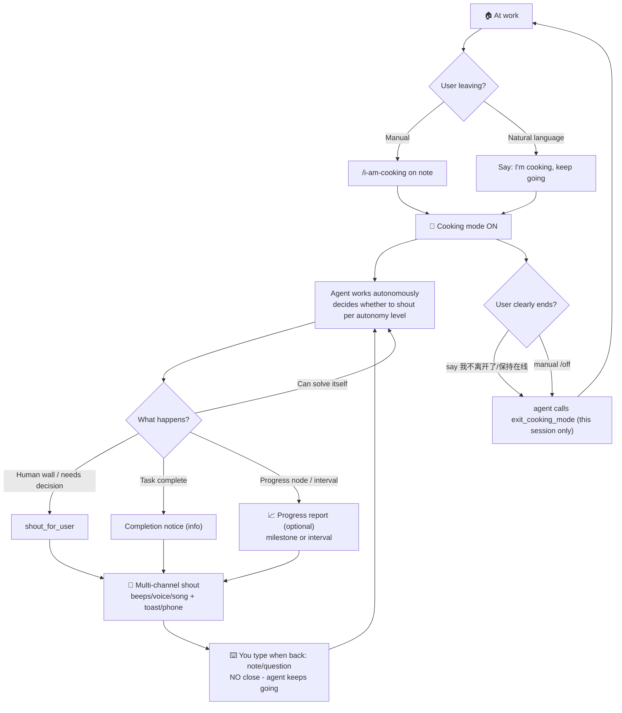

> 中文文档：[README.md](../README.md)
>
# 🍳 I am cooking

> When you step away from the computer (e.g. cooking), pi keeps working autonomously.
> When the agent truly needs you — or when the work is done — it **shouts loudly** through
> sound, Chinese TTS, desktop notifications, and **phone push**, so you can come back from the kitchen.

The name "I am cooking" describes **your** status: the user is away. The agent is the one calling:
_"Agent 需要你！" (Agent needs you!)_

## ✨ Features

| Feature | Description |
|---|---|
| 🧠 Autonomous mode | `/i-am-cooking on` injects "work autonomously, don't wait" rules into the agent |
| 🤖 Agent-initiated | just say "I'm cooking", "我去做饭了" or "我离开一下" — the agent understands and enters away-mode itself (`enter_cooking_mode`) |
| 📣 Multi-channel shout | sound (beeps) + Chinese TTS + desktop toast + **phone push** (ntfy / webhook) + TUI banner |
| 📣 Dynamic status bar | while shouting, status/banner show `📢 正在广播中...`; after it stops, restores to `🍳 离开中 · ⚠N`; press `Ctrl+Alt+M` to stop this time (next time still rings) |
| 🎵 Custom ringtone | 3-stage playback: short beeps → agent voice → **your own song** (`/i-am-cooking sound`), auto-stops after a total budget |
| 🗣️ Agent free speech | when shouting, the agent can speak exactly what it wants (`ttsText`), not just the default template |
| 📱 Phone push | ntfy.sh (free, zero-config) — the key channel when you're in the kitchen |
| 🔔 Completion alerts | agent notifies you when the task is done: "叮咚！好消息！任务完成了！" |
| 🗣️ Custom shout phrase | default "agent 需要你", fully customizable (with placeholder) |
| 🎭 Cute Topic names | auto-generated programming/algorithm-style names (e.g. "幻觉的提示词-483726"), guaranteed unique |
| 🎛️ Dynamic preferences | agent adjusts alert mode from your words: "别喊了" → silence, "完成后喊我" → completion only, "随时汇报" → eager… |
| 🚀 Autonomy levels | how much the agent should call you when blocked: `conservative` (shout on any human wall) / `balanced` (default) / `autonomous` (avoid shouting) |
| 🤝 Multi-agent independence | with multiple pi's away at once: each is fully independent — only one plays sound at a time; closing one does not affect others |
| 🛡️ Safety net | if the agent ends its turn with a question while you're away, it auto-shouts (under `autonomous` level, only errors shout) |
| 🔙 Semantic exit | say "我不离开了/保持在线" → agent understands and exits; or manual `/i-am-cooking off` (closing immediately tells the agent it is back online, stopping away-mode behavior) |
| 🔊 Volume boost | opt-in: auto-raise system volume when you leave, restore when you return (mute state included) |
| 🗣️ Setup wizard | `/i-am-cooking setup` — guided, with ntfy explainer, auto-random topic, preview-then-confirm |
| 🔐 Token security | token fields support `${ENV_VAR}` so secrets never hit disk |
| 🧠 User-editable rules | behavior rules are one `rules.md` file, effective on save |
| 💻 Cross-platform | Windows / macOS / Linux |

## 🎯 Workflow



**In one sentence**: say you're leaving (or just "I'm cooking") → cooking mode on → agent works, shouts you when needed; typing as a note/question does NOT close it (agent keeps going) - only a clear "我不离开了" or `/off` closes this session (others unaffected).
```

**In one sentence**: say you're leaving (or just "I'm cooking") → cooking mode on → agent works, shouts you when needed → you send a message when back → auto-exit (close = close, no debrief; the agent summarizes when it finishes).

## 📦 Install

```bash
# from GitHub
pi install git:github.com/Nita121388/i-am-cooking

# or from npm (published)
pi install npm:i-am-cooking

# or local path during development (from source)
pi install /path/to/your/local/checkout
```

Reload pi (`/reload`) after installing.

## 🚀 Quick start

```
/i-am-cooking setup                     # ① configure phone push (guided wizard)
/i-am-cooking test                      # ② test all channels
/i-am-cooking on 继续做登录模块           # ③ enter cooking mode, then leave
/i-am-cooking off                       # ④ I'm back (closing tells the agent it is back online)
/i-am-cooking status                    # view mode / pending shouts / channels / preference
```

> 💡 **Two ways to enter cooking mode:**
> - **Automatic**: just say "I'm cooking", "我去做饭了，你继续" or "我离开一下，有事喊我" — the agent understands and enters away-mode itself (`enter_cooking_mode`). It only does this when your intent is unambiguous.
> - **Manual**: `/i-am-cooking on [note]` (note can carry preferences, e.g. `on 完成后喊我`).

> ⚠️ **Away state does NOT survive sessions**: every session starts "at work". The cooking state from a previous session is never auto-restored — re-enable it when needed.

## 📖 Commands

| Command | Description | Example |
|---|---|---|
| `/i-am-cooking on [note]` | Enter cooking mode. Note can carry preferences & autonomy level | `on 完成后喊我` / `on 谨慎点继续调研` |
| `/i-am-cooking off` | Leave cooking mode (immediately tells the agent it is back online and to stop away-mode behavior; the agent summarizes when it finishes) | `off` |
| `/i-am-cooking status` | Mode, pending shouts, channels, volume, preferences, level, anti-noise params | `status` |
| `/i-am-cooking setup` | Interactive wizard: phone push + volume + autonomy level | `setup` |
| `/i-am-cooking test` | Test all channels, per-channel real result | `test` |
| `/i-am-cooking stop-sound` | Stop the current playback only (next shout still rings; same as `Ctrl+Alt+M`) | `stop-sound` |
| `/i-am-cooking rules` | Show currently active rules | `rules` |
| `/i-am-cooking edit-rules` | Edit the rules file (saves instantly) | `edit-rules` |
| `/i-am-cooking reset-rules` | Restore factory-default rules | `reset-rules` |
| `/i-am-cooking level [level]` | Autonomy level: conservative / balanced / autonomous (no arg = show) | `level autonomous` |
| `/i-am-cooking limits` | Adjust anti-noise parameters (interactive Chinese menu) | `limits` |
| `/i-am-cooking sound` | Custom shout ringtone (interactive Chinese menu) | `sound` |
| `/i-am-cooking volume` | Volume control: view / manual adjust / auto-boost on leave (interactive Chinese menu) | `volume` |

Tab-completion is supported: type `/i-am-cooking ` then press Tab.

## 🤖 Agent tools (capabilities for the LLM)

Besides your manual commands, the **agent itself calls 4 tools** to understand you, shout at you, and adjust behavior:

| Tool | Purpose | When the agent calls it |
|---|---|---|
| `enter_cooking_mode` | Enter cooking mode | when you **clearly** say you're leaving ("I'm cooking" / "我去做饭了" / "我离开一下"); never on ambiguity |
| `set_shout_sound` | Set the custom shout ringtone | you say "帮我换个铃声" / "use xxx.mp3" and give a concrete path |
| `set_volume` | Adjust system volume | you say "音量调大点/小点声/静音", or before shouting when the system is muted |
| `shout_for_user` | Loudly shout at you | when a task needs you (decision / credential / approval / clarification) — prepare the handoff (just enough) FIRST, then shout; or when the task is done |
| `set_calling_preference` | Adjust calling preference (how loud) | you say "别喊了"→silence, "完成后喊我"→completion_only, etc. |
| `set_autonomy_level` | Adjust autonomy level (whether to shout) | you say "遇墙就喊"→conservative, "能不喊就不喊"→autonomous, etc. |
| `exit_cooking_mode` | Exit away-mode | you clearly end it ("我不离开了/保持在线/先停一下"); NOT for quick notes/questions |

**`shout_for_user` parameters**:

| Param | Required | Description |
|---|---|---|
| `message` | ✅ | handoff note (final, one-shot): what you need to do + essential materials/credentials/steps (only what's needed) |
| `urgency` | ✅ | `info` (completion) / `normal` / `urgent` |
| `category` | ❌ | decision / credential / approval / clarification / help |
| `ttsText` | ❌ | **free speech**: TTS speaks this exactly, bypassing the default template |

> These tools degrade safely when cooking mode is off (e.g. `shout_for_user` tells the agent "the user is right there") — no spurious shouts.

### What the agent CANNOT set (safety boundary)

| Config | How to set | Why not the agent |
|---|---|---|
| 📱 Phone push (ntfy/webhook + token) | `/i-am-cooking setup` wizard / manual config.json | sensitive credentials, human-only |
| 🔊 Volume boost toggle | `/i-am-cooking setup` wizard | system-level change, needs explicit consent |
| 🛡️ Anti-noise parameters | `/i-am-cooking limits` | guardrail defaults are sensible, avoid accidental changes |
| 🧠 Rules file rules.md | `/i-am-cooking edit-rules` / manual edit | rules are the user's will; the agent must not edit itself |
| 🔘 Toggles (sound/tts/toast) | `/i-am-cooking sound` menu "开关" | supported via command |
| 🔙 Exit cooking mode | no tool (only user message / `off`) | prevent the agent from disabling away-mode itself |

## 🧠 User-editable rules

The behavior rules while you're away are not hard-coded — you can edit them:

```
/i-am-cooking edit-rules    # open editor, save = immediately effective
/i-am-cooking rules         # show currently active rules
/i-am-cooking reset-rules   # restore factory default
```

The rules file is `~/.pi/i-am-cooking/rules.md` (Markdown), auto-created on first run from the
factory template. It is the **single source of effective rules** — edit it with any editor.

The factory template lives in the repo at `extensions/i-am-cooking/rules.default.md` (shipped with
the plugin). It is copied into the user file on first run; after that the user fully owns `rules.md`.

### ⏰ When do rules take effect?

Rules are **re-read every turn with zero caching** — the plugin re-reads the file in `before_agent_start` and injects it into the system prompt. So:

```
edit rules.md in any editor → save
  ↓ no restart / no /reload / no need to re-`on`
next agent turn → new rules active
```

| What you change | Effect |
|---|---|
| add a rule like "never touch production code" | agent follows it from the next away-turn (depends on LLM) |
| delete the "when to shout" section | shout timing is handled by the autonomy level guide (a mechanism layer, unaffected) |
| empty the whole file | only the guard rail + level guide remain; the agent still never idles |
| edit the file while NOT in cooking mode | **no effect** (rules are only injected during cooking mode) |
| edit the repo `rules.default.md` | does not affect an existing user rules.md; only affects fresh installs / `reset-rules` |

> ⚠️ Rules are **only injected during cooking mode** (`before_agent_start` checks `config.cooking`) — editing them mid-conversation does nothing.

A guard rail is always appended and cannot be removed: "never end your turn silently waiting for user input" — this prevents the agent from idling if rules are emptied.

## 🧠 Dynamic calling preferences

The agent picks a mode from what you say, and adjusts instantly:

| You say | Mode | Effect |
|---|---|---|
| *(nothing)* | `normal` (default) | shout when needed + when done |
| "别喊了" / "安静" / "别打扰" | `silence` | no sounds at all, TUI banner only |
| "完成后喊我" / "干完通知我" | `completion_only` | ring only when work is done |
| "只有紧急才找我" | `urgent_only` | ring only for urgent |
| "随时汇报" / "每步告诉我" | `eager` | shout for needs, completions, and progress |

Two detection paths (belt & suspenders):

1. **Text matching** (extension code, instant): keywords in your typed messages or `on` notes.
2. **Semantic understanding** (agent): the agent calls `set_calling_preference` for expressions the keywords don't cover, e.g. "我睡会儿".

## 🚀 Autonomy levels

Calling preference controls **how loudly** the agent shouts; **autonomy level** controls **whether it should shout at all** when blocked (e.g. a **human wall**: captcha / login / manual clicks that only you can do). The two are orthogonal.

```
/i-am-cooking level                   # show current level
/i-am-cooking level conservative      # careful: shout on any human wall
/i-am-cooking level balanced          # balanced (default): shout when it's hard enough
/i-am-cooking level autonomous        # hands-off: avoid shouting
```

| Level | Behavior |
|---|---|
| `conservative` | Shout immediately on any human wall (captcha / login / manual clicks); confirm with you before decisions / approvals / credentials / clarifications; ask when requirements are ambiguous; only do fully-deterministic, low-risk work autonomously |
| `balanced` (default) | Shout only on human walls; ordinary decisions / ambiguity → proceed with the most reasonable default and note your assumption; shout only when "can't proceed after autonomous attempts" or "wrong choice is costly" |
| `autonomous` | Avoid shouting; make and log all decisions/assumptions yourself; shout only when the task is completely stuck (no permission / external service down / hard constraint violated) |

> All three levels embed a **quality guarantee**: autonomy ≠ lower standards — when unsure, pick the safest approach.

The level persists (config.json, survives across sessions); switch via `on` note (`on 谨慎点继续`), natural speech ("遇墙就喊我" / "能不喊就不喊"), or agent semantic understanding (`set_autonomy_level`).

## 🔊 Custom shout ringtone (advanced)

The shout sound plays in order **short beeps → agent voice → your custom song**, stopping automatically when the total budget is reached:

```
/i-am-cooking sound
```

Interactive Chinese menu: show current settings / set a custom song / preview / set total duration (default 60 s) / clear the song.

**Two ways to set a song:**
- **File browser**: start from `~/Music`, browse folders (📁) and audio files (🔊) level by level — no need to type a path
- **Manual path**: type a full path (e.g. `~/Music/闹铃.mp3`)

You can also just tell the agent "帮我换个铃声" with a path — it calls the `set_shout_sound` tool to set it for you.

| Stage | Description |
|---|---|
| ① Short beeps | system beeps (default 4) |
| ② Agent voice | Chinese TTS. The agent can pass `ttsText` to `shout_for_user` to **speak exactly what it wants** (e.g. "叮咚！方案 A 和 B 我拿不准，快回来看看！"); otherwise the default template is used |
| ③ Custom song | your audio file (macOS: mp3/wav/m4a; Linux: wav/ogg; Windows: wav recommended) |
| ⏱ Total duration | default 60 s, force-stopped at the limit, adjustable (1–300 s) |

> Format tip: **wav works everywhere**; mp3 is best on macOS/Linux.

### 📣 Dynamic status indicator & stop current playback

While in cooking mode, the status bar (footer) and the banner above the editor stay minimal — they act as a **signal light**, not a details page:

| State | Status bar | Banner |
|---|---|---|
| Away, quiet | `🍳 离开中 · ⚠N 待处理` | `🍳 离开中 · ⚠N 待处理 · /status 看全部` |
| **Shouting (ringing)** | `📢 正在广播中...（Ctrl+Alt+M 静音）` (highlighted) | same + one `📢` line |
| After it stops / stopped | auto restores `🍳 离开中 · ⚠N 待处理` | same |

**Design principle**: the banner only shows *count + state*, never lists message contents — plans, progress and task summaries live in the conversation history (the agent writes a summary when done); run `/i-am-cooking status` to inspect all pending details. So the banner is 1 line normally, 2 lines max while ringing.

**Typing = acknowledged**: while in cooking mode, typing anything (answering a shout / giving new instructions) immediately stops any ringing audio and marks previous shouts as handled (removed from the banner). The agent keeps working autonomously; *new* shouts from now on show/ring as usual.

**Stop the current playback** (don't want this ring, but keep the pending shouts):

- Shortcut: `Ctrl+Alt+M` (M = Mute; rebindable in `~/.pi/agent/keybindings.json`)
- Command: `/i-am-cooking stop-sound`

Stopping **only kills the currently playing audio** — it changes no config, does not disable sound, and does not clear pending shouts, so **the next shout rings as usual**.

> ⚠️ Note: pi's terminal status bar has no mouse click support, so a keyboard shortcut replaces "click to close"; it only affects audio playing in this terminal (each agent stops its own).

**Three messages, three channels** (know what happened by the sound/notification):

| Message | Channel | Example |
|---|---|---|
| 🚨 Need you | full 3-stage ring: 4 beeps + voice + your song (most attention-grabbing) + toast/banner/phone | "need you to decide A or B" |
| ✅ Whole completion | 2 beeps + completion voice (no song, quiet good news) + toast/banner/phone | "all tasks done!" |
| 📈 Progress (milestone / interval) | **phone-push only** (no ring / toast / banner), one lightweight local notice | "downloaded 3/10 files" |

> 📈 **Progress reporting mode (pick one of three)**: each time you manually enter cooking mode it asks "进度汇报" — ① milestone (default) / ② interval (every 15 min, even without progress) / ③ none. **Progress goes to your phone only** (visible on the lock screen, unobtrusive); urgent/completion are unaffected. **Once a ✅ completion notice arrives, the interval timer stops automatically** — no more progress pings after the task is done.

## 📱 Phone push setup

```
/i-am-cooking setup
```

Guided flow: pick ntfy (recommended, free) → it explains what ntfy is, how to install the app
(Android / iOS), auto-generates a random topic → enter optional access token → preview & confirm → live test.

> 🎭 **Auto-generated Topic**: random programming/algorithm-style cute name + 6 digits (e.g. `i-am-cooking-幻觉的提示词-483726`) — 528 million combinations, globally unique. You can override it manually.

Manual config in `~/.pi/i-am-cooking/config.json`:

```json
{
  "phonePush": true,
  "pushProvider": "ntfy",
  "ntfyTopic": "i-am-cooking-your-random-topic",
  "ntfyToken": "${NTFY_TOKEN}",
  "autonomyLevel": "balanced",
  "soundSeconds": 60
}
```

Tokens support `${ENV_VAR}` / `$ENV_VAR` references. Webhook providers (Bark, WeChat Work bot,
ServerChan) are supported via `pushProvider: "webhook"` + `webhookUrl`.

> Other fields (`beeps` / `soundPath` / `repeatIntervalMinutes` …) have sensible defaults; adjust them with the commands instead of hand-editing: `/i-am-cooking level`, `/i-am-cooking sound`, `/i-am-cooking limits`.

## 🔊 Volume control (opt-in)

### Manual adjust & view

```
/i-am-cooking volume
```

Interactive Chinese menu: view current system volume / set volume immediately (0-100) / set "boost level on leave" / toggle "auto-boost on leave".

**The agent can also adjust volume** (`set_volume` tool): when you say "音量调大点/小点声/静音", or it unmutes before shouting so you can hear it.

### Auto-boost on leave (opt-in)

Prevents you missing the shout when the system volume is low or muted:

| Platform | Implementation |
|---|---|
| Windows | Core Audio API (via PowerShell, no deps) |
| macOS | `osascript` (built-in) |
| Linux | `pactl` (PulseAudio) |

When enabled, entering cooking mode raises volume to `boostLevel` (default 80) only if it's lower,
and restores the original value **and mute state** on exit (macOS reads both `output volume` and
`output muted`). You are asked explicitly in the setup wizard.

## 🛡️ Anti-noise guards (defaults, adjustable)

> Need-you / whole-completion / milestone are **three different kinds of messages** — each has its own independent limits.

| Limit | Applies to | Default | Adjust |
|---|---|---|---|
| Same task completion never repeats | ✅ whole completion | never repeats | fixed |
| Max completion notices per away period (different tasks) | ✅ whole completion | 3 | `/i-am-cooking limits` |
| Milestone reminders | 📈 milestone | ① milestone (default, ask on enter); phone-push only | ask on enter |
| Interval progress reports | ⏰ progress | off (② → every 15 min); phone-push only; auto-stops after completion | ask on enter |
| Normal shout repeat | ⚠️ normal shout | **3 minutes** (once) | `/i-am-cooking limits` |
| Urgent shout repeats | 🚨 urgent shout | **1 minute**, until you return | `/i-am-cooking limits` |
| Deduplicate same message | all messages | within 10 min | fixed |

Run `/i-am-cooking limits` for an interactive Chinese menu — no need to memorize English params.

## 🤝 Multi-agent scenarios (multiple pi's away at once)

When multiple pi's (e.g. two terminals / one terminal + RPC) are in cooking mode simultaneously:

| Capability | Behavior |
|---|---|
| 🔊 Audio mutual exclusion | **only one sound plays at a time**. Later agents skip the sound (keep toast/push/banner) to avoid overlap; user-initiated `/i-am-cooking test` or preview can **preempt** |
| 🔙 Independent close | closing one agent ("我不离开了" or `/i-am-cooking off`) **only affects that agent** — others keep working, no need to re-enable |

> Crash recovery: audio locks left by crashed agent processes are auto-detected (process-alive check) and preempted; a 75 s timeout guards against pid-reuse misjudgment.

### 🗣️ Custom shout phrase

The "agent 需要你" in all shout copy (TTS / toast / push / banner) can be changed to anything. Edit `shoutPhrase` in `config.json`:

```json
{ "shoutPhrase": "快来救我" }
```

TTS templates use the `{shoutPhrase}` placeholder (default `叮咚！{shoutPhrase}！{message}`) — change once, applies everywhere.

## 🖥️ Platform support

| Platform | Sound | Chinese TTS | Custom song | Desktop notif | Phone push | Volume |
|---|---|---|---|---|---|---|
| Windows | ✅ | ✅ | ✅ wav | ✅ Toast | ✅ | ✅ |
| macOS | ✅ | ✅ | ✅ mp3/wav/m4a | ✅ | ✅ | ✅ |
| Linux | ✅¹ | ✅¹ | ✅¹ wav/ogg | ✅¹ | ✅ | ✅¹ |

¹ Linux: `canberra-gtk-play` / `espeak-ng` / `paplay` / `notify-send` / `pactl` — install the relevant packages.

## ✅ Verification checklist

Before every release, run through [docs/VERIFICATION.md](docs/VERIFICATION.md).

## 📄 License

MIT — see [LICENSE](LICENSE).

## 🏷️ Gallery

Tagged `pi-package` — automatically listed on [pi.dev/packages](https://pi.dev/packages).
